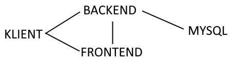
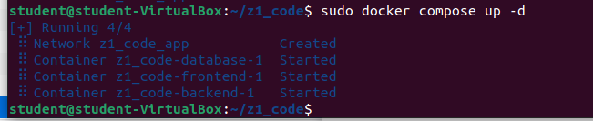

# Co i jak

Projekt jest zbudowany używając Angular'a jako frontendu, ASP.NET Core (.NET 6.0) na backendzie, oraz MySQL 8 jako serwera bazy danych.

# Architektura

Artystycznie uzdolniony nie jestem, więc 'tekstorysunek' musi wystarczyć ;-)

Kreski wskazują połączenie/komunikację. Po krótce: Klient pobiera aplikację z frontendu, wysyła zapytania do backendu, a backend - do MySQL.

# Skopiowane lab9?

Nie. Własnoręcznie wykonana całość kodu. Oczywiście, tu i ówdzie zapytałem o coś innych studentów, którzy mogli wiedzieć o czymś lepiej ode mnie :-)

# Dodatkowa dokumentacja

Kontenery uruchamiają się tak jak powinny - `docker compose up -d` działa jak należy.

